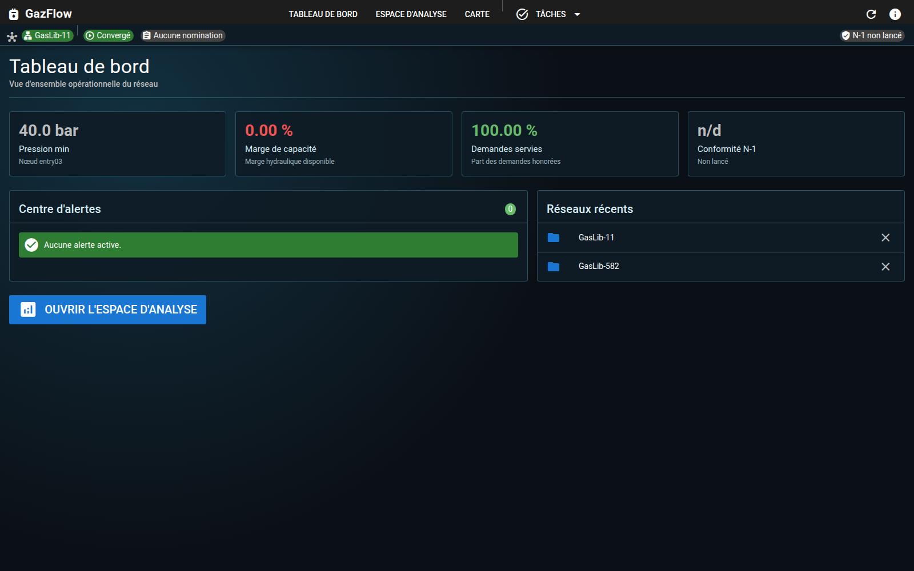
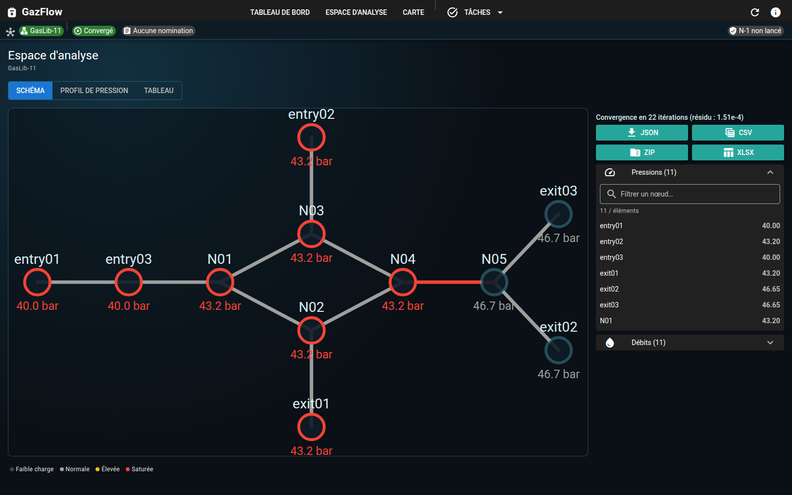
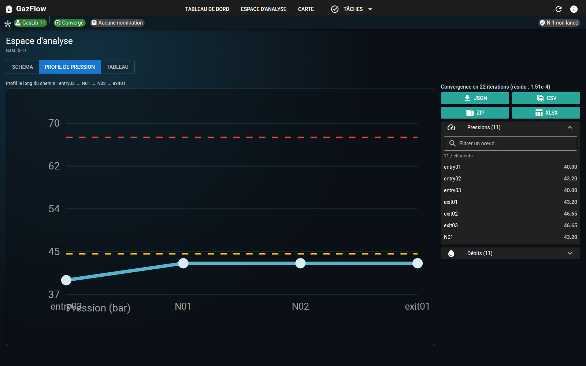
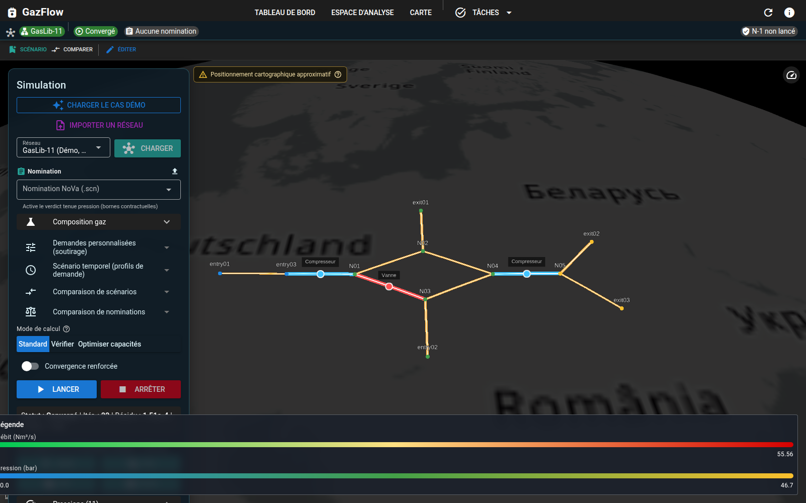

# GazFlow

Natural gas network flow simulator, inspired by SIMONE.

## Visual overview

<table>
  <tr>
    <td align="center" width="50%">
      
    </td>
    <td align="center" width="50%">
      
    </td>
  </tr>
  <tr>
    <td align="center"><em>Operational dashboard</em></td>
    <td align="center"><em>Workspace: 2D schematic</em></td>
  </tr>
  <tr>
    <td align="center" width="50%">
      
    </td>
    <td align="center" width="50%">
      
    </td>
  </tr>
  <tr>
    <td align="center"><em>Workspace: pressure profile</em></td>
    <td align="center"><em>3D map with results</em></td>
  </tr>
</table>

## Interface: overview-first

The UI is organised around an **operational overview before deep analysis**:

- **Tableau de bord** (`/`) — landing page. Aggregates operational KPIs (min pressure, capacity margin, demand served, N-1 compliance), an alert center (capacity violations, sink diagnostics, solver warnings, N-1 alerts), recent networks, and contextual CTAs.
- **Espace d'analyse** (`/workspace`) — multi-view analytical workspace with a segmented switcher between a **2D nodal schematic** (pipe load colours, node pressures), a **pressure profile** along a path, and a **results table** (nodes + pipes), side-by-side with a **results rail** (verdict, sink diagnostics, boundary supply, capacity study, exports). The **ResultsRail** hosts the NoVa workflow stepper (Verdict → Causes → Capacity → Export).
- **Carte** (`/map`) — Cesium 3D geospatial view with the **SimulationPanel** (same NoVa stepper and certification flow), property panel, and legend. When no network is loaded it redirects to the dashboard.
- **Global status bar** — a persistent bar (network, run status, nomination, N-1 compliance) shared across all pages.
- **Task-oriented navigation** — primary entries (Dashboard, Workspace, Map) plus a "Tâches" menu grouping Import, N-1, Calage SCADA, Transitoire, Exports, Batch.

## What GazFlow does (business vision)

GazFlow simulates gas flow in transport and distribution networks. Beyond the original GasLib steady-state workflow, it supports **real network import**, **multi-component gas**, **regulation equipment**, **hourly demand scenarios**, **N-1 contingency analysis**, **SCADA calibration**, **topological editing with scenario compare**, and a **transient** mode (quasi-steady or 1D PDE MVP on simple topologies).

The tool computes hydraulic operating points (nodal pressures, pipe flows in Nm³/s), presents them on a **Cesium 3D map**, streams progress over **WebSocket**, and exports results (JSON/CSV/XLSX/ZIP). Optional **min/max flow bounds** per node support **check** and **optimize** capacity workflows.

### Use cases

- Study hydraulic behaviour under different withdrawal/injection levels and gas compositions (G20, H₂ blends with auto PR-78 above 20 % H₂)
- **Validate transport nominations (NoVa)**: feasibility verdict, deficit causes, per-sink capacity, save reduced nomination, N-1 on nomination, certification report
- Import a network from **GeoJSON, CSV + YAML mapping, or Shapefile** and run operational scenarios
- **24 h timeseries** with thermosensitive demand profiles, weather CSV, weekday/weekend curves
- **N-1 security analysis** with parallel contingency runs, map overlay, Excel/CSV export
- **Calibrate** roughness (and limited demand scale) against SCADA pressure/flow measurements
- Save **topological variants** as scenarios and **compare** ΔP/ΔQ between variants
- Explore **transient** response (linepack tracking; PDE mode on single pipe / series chains)
- Document results via export history (`/exports` page)

### What the tool is not

GazFlow is a simulation and visualisation tool for **comparative studies**. It does not replace a certified network operation simulator or real-time SCADA.

### Capacity constraints (min / max flows)

The steady-state hydraulic core still solves for pressures and pipe flows from **nodal demands** (injections positive, withdrawals negative). On top of that, you can work with **flow bounds**:

- **From GasLib (`.net`)**: optional `flow_min` / `flow_max` on nodes and pipes are parsed into the graph. Node bounds appear on `GET /api/network` as `flow_min_m3s` / `flow_max_m3s`. Pipe bounds are kept on the backend and used whenever you run a capacity-aware solve.
- **From the client**: `POST /api/simulate` and the WebSocket `start_simulation` message accept optional `capacity_bounds` (`{ "nodeId": { "min", "max" } }`, m³/s) and optional `mode`:
  - **check** — Run the usual solve with your demands, then return `capacity_violations` where effective node net flows or pipe flows fall outside bounds.
  - **optimize** — Iterative **projection**: bounded free-node demands are clamped and the hydraulic solve is repeated; if a **slack** node (fixed pressure) would exceed its bounds, bounded free-node demands are adjusted proportionally until slack is feasible or an infeasibility / stagnation diagnostic is returned. The response includes **adjusted demands**, **active bounds**, and a simple squared-distance **objective** vs the target scenario.

This supports operational questions such as “does this nomination respect entry/exit-style envelopes?” and “what feasible demands are closest if the source is capped?”. It is **not** full market or contract optimisation (products, time slices, tariffs) unless you encode them yourself as static min/max.

For the algorithm and limitations in depth, see [Capacity constraints plan](docs/plans/capacity-constraints-plan.md).

## Architecture

- **back/** — Rust backend: computation engine (Darcy-Weisbach, Newton-Raphson) + REST API (Axum)
- **front/** — Vue 3 / QuasarJS / CesiumJS frontend: overview-first dashboard, multi-view analysis workspace, and 3D geospatial visualisation
- **docker/** — Dockerfiles for back and front services
- **docs/** — Documentation (architecture, science, plans)

## Prerequisites

- Docker & Docker Compose

That’s it. Rust and Node toolchains live inside the containers.

## Quickstart

```bash
# 1. Download GasLib data
./scripts/fetch_gaslib.sh GasLib-11

# 2. Start the development environment
./scripts/dev.sh
```

- Backend (Rust API): `http://localhost:3001`
- Frontend (Quasar/CesiumJS): `http://localhost:9000`

## Scripts


| Script                      | Description                                        |
| --------------------------- | -------------------------------------------------- |
| `./scripts/dev.sh`          | Starts back + front via Docker Compose             |
| `./scripts/stop.sh`         | Stops all containers                               |
| `./scripts/back-shell.sh`   | Shell in the back container (`cargo add`, etc.)    |
| `./scripts/front-shell.sh`  | Shell in the front container (`npm install`, etc.) |
| `./scripts/back-test.sh`    | Runs `cargo test` in the container                 |
| `./scripts/front-test.sh`   | Runs `npm test` in the container                   |
| `./scripts/ci.sh`           | Full CI (build + back & front tests)               |
| `./scripts/fetch_gaslib.sh` | Downloads GasLib data                              |


## Adding a dependency

Always use the container:

```bash
# Rust
./scripts/back-shell.sh
cargo add my-crate

# Node
./scripts/front-shell.sh
npm install my-package
```

The `Cargo.toml` and `package.json` files are on the shared volume: changes are visible on the host and versioned by git.

## Tests

```bash
./scripts/back-test.sh     # Rust tests (~270 lib tests)
./scripts/front-test.sh    # Frontend tests (116 tests)
./scripts/ci.sh            # Full CI (+ corpus verification step)
```

Current baseline (2026-07-10): `cargo test --lib` ~270 tests, `npm test` 116/116.

Large transport networks (GasLib-582, GasLib-4197): optional smoke tests and env knobs are documented in [Testing](docs/testing/README.md). Model limits (compressor MVP, `.cdf` routing, convergence) are in [Limitations](docs/science/limitations.md).

**GasLib-582 transport (Phase I, juin–juillet 2026)** : bench `nomination_mild_618.scn` via `compressor_diag`. Résidu **2,045 m³/s** avec nomination intacte (partial accept, cible 3×10⁻³). v18 (abandon Q sur boundaries) abaisse le résidu effectif à ~2,0 m³/s mais **viole la nomination** — voir `nomination_mass_balance` et `boundary_nomination_slips` dans le JSON diag. Détails : [bench 582](docs/testing/gaslib-582-compressor-bench.md), [diagnosis 582](docs/testing/gaslib-582-compressor-diagnosis.md).

## Licensing

GazFlow source code is published under the [GazFlow Public License v1.0](LICENSE):

- **Free** for individuals and academic non-commercial use
- **Commercial license required** for any enterprise or organization (companies, utilities, public bodies, contractors acting on their behalf)

See [LICENSING.md](LICENSING.md) and [COMMERCIAL-LICENSE.md](COMMERCIAL-LICENSE.md). Contact: `licensing@improba.fr`.

## Documentation

- [Quickstart](docs/quickstart.md)
- [Architecture](docs/architecture/overview.md)
- [Results export contract](docs/architecture/export-contract.md)
- [API stub (OpenAPI)](docs/contracts/openapi-stub.yaml)
- [Physical equations](docs/science/equations.md)
- [Model limitations](docs/science/limitations.md)
- [Testing & validation](docs/testing/README.md)
- [GasLib-582 compressor bench (Phase I)](docs/testing/gaslib-582-compressor-bench.md)
- [Operational roadmap P6–P13](docs/plans/operational-roadmap.md)
- [Completion plan](docs/plans/completion-plan.md)
- [Production sprint plan](docs/plans/production-sprint-plan.md)
- [Capacity constraints plan](docs/plans/capacity-constraints-plan.md)
- [Test corpus](docs/testing/corpus/README.md)
- [Implementation plan (shared)](docs/plans/implementation-plan.md)
- [MVP features](docs/features/mvp.md)
- [NoVa persona (Camille)](docs/personas/ingenieur-natran.md)
- [NoVa interface plan](docs/temp/plan-interface-natran-nova.md)

