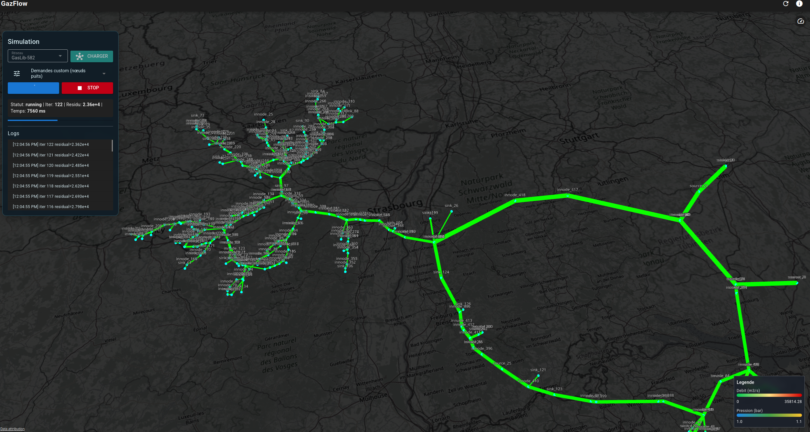
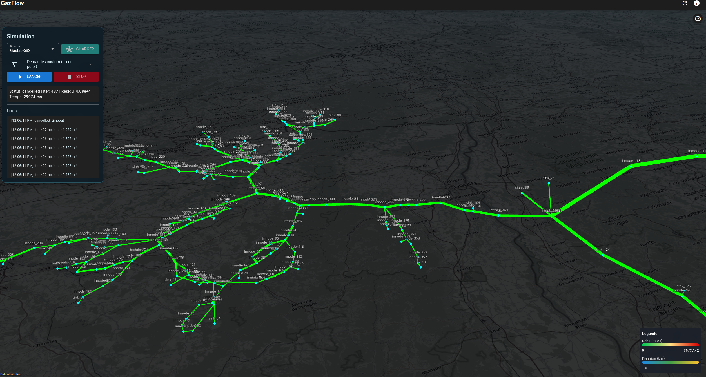
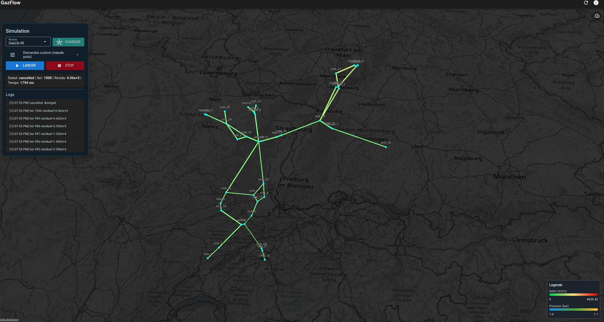

# GazFlow

Natural gas network flow simulator, inspired by SIMONE.

## Visual overview

<table>
  <tr>
    <td align="center" width="33%">
      
    </td>
    <td align="center" width="33%">
      
    </td>
    <td align="center" width="33%">
      
    </td>
  </tr>
  <tr>
    <td align="center"><em>3D network map</em></td>
    <td align="center"><em>Scenario control</em></td>
    <td align="center"><em>Reading results</em></td>
  </tr>
</table>

## What GazFlow does (business vision)

GazFlow simulates gas flow in a transport network from a GasLib topology and a demand scenario. The tool computes a steady-state hydraulic operating point (nodal pressures and pipe flows), then presents it for operational reading: 3D map, convergence monitoring, and usable exports.

### Use cases

- Study the hydraulic behaviour of a network under different withdrawal/injection levels
- Quickly visualise high/low pressure zones and the most loaded pipes
- Compare scenarios and document results (JSON/CSV/ZIP)

### What the tool is not

GazFlow is a simulation and visualisation prototype inspired by industrial tools. It does not replace a certified network operation simulator.

### Perspective

Today the simulator takes **fixed** injection and withdrawal flows per node and computes the resulting pressures and pipe flows. A natural extension would be to take **entry/exit capacities** into account (min/max flow per point), so as to simulate the effects of **purchases and sales**: e.g. limit injections and withdrawals to contractual or physical capacities, and either check that a given scenario stays within those bounds or optimise flows within them.

## Architecture

- **back/** — Rust backend: computation engine (Darcy-Weisbach, Newton-Raphson) + REST API (Axum)
- **front/** — Vue 3 / QuasarJS / CesiumJS frontend: 3D geospatial visualisation
- **docker/** — Dockerfiles for back and front services
- **docs/** — Documentation (architecture, science, plans)

## Prerequisites

- Docker & Docker Compose

That’s it. Rust and Node toolchains live inside the containers.

## Quickstart

```bash
# 1. Download GasLib data
./scripts/fetch_gaslib.sh GasLib-11

# 2. Start the development environment
./scripts/dev.sh
```

- Backend (Rust API): `http://localhost:3001`
- Frontend (Quasar/CesiumJS): `http://localhost:9000`

## Scripts

| Script | Description |
|--------|-------------|
| `./scripts/dev.sh` | Starts back + front via Docker Compose |
| `./scripts/stop.sh` | Stops all containers |
| `./scripts/back-shell.sh` | Shell in the back container (`cargo add`, etc.) |
| `./scripts/front-shell.sh` | Shell in the front container (`npm install`, etc.) |
| `./scripts/back-test.sh` | Runs `cargo test` in the container |
| `./scripts/front-test.sh` | Runs `npm test` in the container |
| `./scripts/ci.sh` | Full CI (build + back & front tests) |
| `./scripts/fetch_gaslib.sh` | Downloads GasLib data |

## Adding a dependency

Always use the container:

```bash
# Rust
./scripts/back-shell.sh
cargo add my-crate

# Node
./scripts/front-shell.sh
npm install my-package
```

The `Cargo.toml` and `package.json` files are on the shared volume: changes are visible on the host and versioned by git.

## Tests

```bash
./scripts/back-test.sh     # Rust tests
./scripts/front-test.sh    # Frontend tests
./scripts/ci.sh            # Full CI
```

## Documentation

- [Quickstart](docs/quickstart.md)
- [Architecture](docs/architecture/overview.md)
- [Results export contract](docs/architecture/export-contract.md)
- [Physical equations](docs/science/equations.md)
- [Implementation plan (shared)](docs/plans/implementation-plan.md)
- [MVP features](docs/features/mvp.md)
