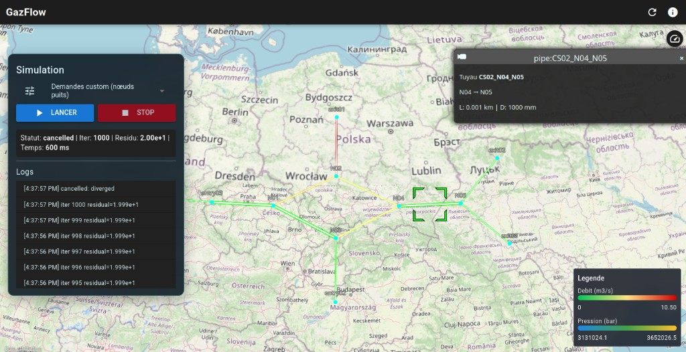

# Quickstart

Demarrage le plus rapide pour lancer une simulation GazFlow en local.



## Prerequis

- Docker
- Docker Compose

## 1) Recuperer un dataset

```bash
./scripts/fetch_gaslib.sh GasLib-11
```

## 2) Lancer l'environnement

```bash
./scripts/dev.sh
```

## 3) Ouvrir l'application

- Frontend: `http://localhost:9000`
- Backend API: `http://localhost:3001`

## 4) Demarrer une simulation

1. Ouvrir la page carte.
2. Dans le panneau **Simulation**, cliquer **Lancer**.
3. Suivre la progression (iterations, residu, logs) en live.
4. Exporter en JSON/CSV/ZIP une fois convergee.

## Arret

```bash
./scripts/stop.sh
```

